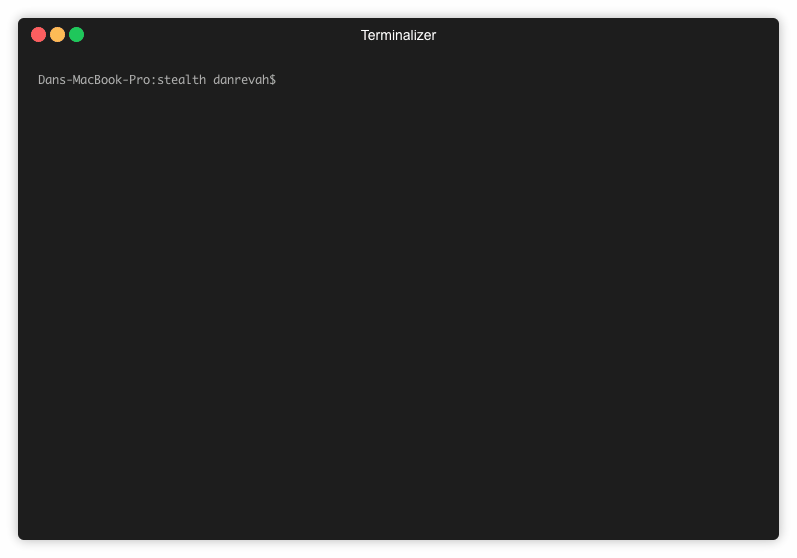

#  Stealth Project

Emulating an encrypted tunnel using relays (Based on TOR concept).

## Overview

The project is separated to 3 applications:

### Relay
Relay is where the traffic passes through before reaching it destination.
Relays add to the speed and robustness of the network.

### Client
Client gets a list of relays, and creates an encrypted chain of messages with their public keys. 

The encrypted chain encrypts an HTTP GET request that will be passed to the initial relay (and passed on until it reaches it's destination).

### Trusted Server
Trusted server is the main server which hold a list of relay's and their public keys.

Clients interact with a trusted server to get list of relays to use in their tunnel to web.

Relays interact with a trusted server to add itself to the network relay's list.

## Examples 

<p align="center"><b>Client</b></p>
<p align="center">
  
</p>

<p align="center"><b>Trusted Server</b></p>
<p align="center">
  
</p>

<p align="center"><b>Relay</b></p>
<p align="center">
  
</p>


## Configuration
In `com/openu/security/tor/app/Services/Config.java` we should configure TrustedServer IP, PORT and PUBLIC_KEY.
This is hardcoded into the client & relays in order to prevent MITM attacks.

```java
public class Config {
    public final static String TRUSTED_SERVER_HOST = "127.0.0.1";
    public final static String TRUSTED_SERVER_PORT = "3000";
    final static public String TRUSTED_SERVER_PUBLIC_KEY = "...";

}

```
## Install

```sh 
$ mvn install
```

## Compile

```sh 
$ mvn clean compile assembly:single
```

## Run tests

```sh 
$ mvn test
```

## Run

```sh 
$ ./bin/proxy 
```

## Conclusions of Pen-Test

1. MITM Trusted Server - Trusted server private key is contained in the compiled version of this project (Fix in TODO's #1 + #2).
 
2. Detection - Pushing many relay's into the network could result in the detection of the client. Assuming client uses a 3 relays chain, in-case those 3 relays belongs to the one who was trying to detect users, it is possible to expose the user. The exit relay can know what request was made, and the first relay can identify the client, not for sure, since it can't really tell if it's a client or a relay, but this can easily been checked by getting the relay's list from the TrustedServer (Fix in TODO's #3).

3. Denial of service - It is possible to spam the network with fake relays, making it in-accessible to users (Fix in TODO's #4 + #5).

## TODO

1. In order this to be secured, the TrustedServer should be compiled separately!
Since the private-key is hardcoded and the client and relay jar's should not have access to this information.

2. Private & Public key is included in this repository which is not safe to use, generation of a new key pair is required.

3. Exit relays should be from a list of well-known relays in-order to prevent spoofing & detection.

4. TrustedServer should ping relays every X seconds to validate is alive and responds (maybe route a message and get a response?).

5. TrustedServer should check, before adding a new relay, if there's already a relay with the same IP, if so he should handle this scneario (remove old, add new).

